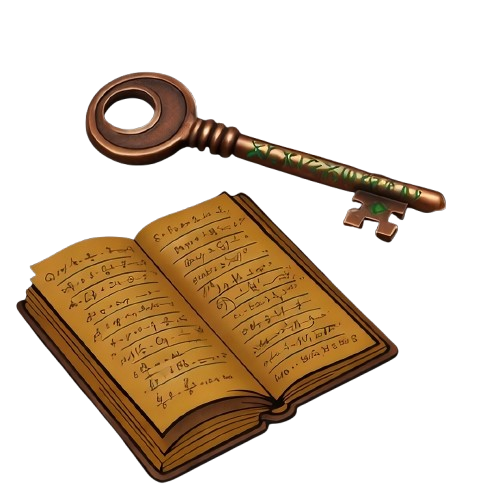
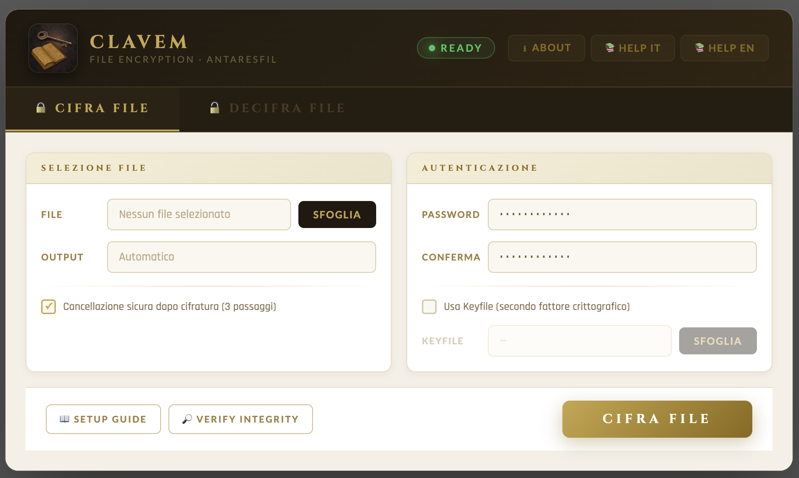

<p align="center">
  
</p>

<h1 align="center">CLAVEM</h1>

<p align="center">
  Secure file encryption tool for long-term data protection.
</p>

<p align="center">
  
  
  
  
  
</p>

<p align="center">
  by <strong>Massimo Parisi (antaresfil)</strong><br/>
  📧 <a href="mailto:clavemhelp@noxfarm.com">clavemhelp@noxfarm.com</a> &nbsp;|&nbsp;
  🛠️ Support: <a href="mailto:clavemhelp@noxfarm.com">clavemhelp@noxfarm.com</a>
</p>

---

<p align="center">
  
</p>

## What is CLAVEM?

**CLAVEM** is a Windows desktop application that encrypts files and folders using modern, authenticated cryptography. It is designed for users who want strong, local, offline protection for sensitive data — with no cloud, no accounts, and no backdoors.

Every encrypted file becomes a `.svlt` container. Without the correct password (and keyfile, if used), the content is computationally unrecoverable.

---

## Features

- 🔒 **AES-256-GCM** — authenticated encryption (confidentiality + integrity in one pass)
- 🔑 **Argon2id** key derivation — memory-hard, GPU/ASIC resistant (OWASP recommended)
- 📎 **Optional keyfile** — cryptographic second factor derived from file content only (name and path are ignored)
- 🗂️ **File and folder encryption** — folders are packaged as ZIP then encrypted in a single `.zip.svlt`
- 🗑️ **3-pass secure delete** — optional DoD-style overwrite of the original after encryption
- 🛡️ **Privacy-preserving design** — CLAVEM never stores or reveals whether a keyfile was used
- ✅ **Legacy compatibility** — reads SVLT v1, v2, and v3 containers
- 🖥️ **DPI-aware UI** — PerMonitorV2 manifest, ClearType rendering on all displays

---

## Cryptographic Design

| Component | Algorithm | Notes |
|-----------|-----------|-------|
| Encryption | AES-256-GCM | 128-bit authentication tag |
| Key Derivation | Argon2id | 64 MiB · 3 iterations · 4 lanes |
| Salt | 256-bit random | Per-file, generated via OS CSPRNG |
| Nonce | 96-bit random | Per-file, generated via OS CSPRNG |
| Keyfile hashing | SHA-256 | Content-only — path and filename ignored |

**Master key construction:**

```
Password only:         M = UTF8(password)
Password + Keyfile:    M = UTF8(password) || 0x00 || SHA-256(keyfile_bytes)
```

`M` is then passed to Argon2id with a per-file random salt to derive the AES-256-GCM key.

**SVLT v3 container layout:**

```
[4 bytes]  Magic: "SVLT"
[1 byte ]  Version: 3
[32 bytes] Salt (Argon2id)
[12 bytes] Nonce (AES-GCM)
[16 bytes] Authentication Tag (GCM)
[n bytes ] Ciphertext  ← includes original filename inside encrypted payload
```

> In v3, the filename is protected inside the ciphertext — not stored in the cleartext header.  
> The entire header is authenticated as AAD: any tampering causes immediate decryption failure.

---

## Security Fixes in v2.0.2

| # | Issue | Severity | Status |
|---|-------|----------|--------|
| 1 | Master-key zeroing bug — `DeriveMasterKey` returned an already-zeroed buffer | Critical | ✅ Fixed |
| 2 | Integer overflow on payload sizing near 2 GB | High | ✅ Fixed |
| 3 | Infinite loop in `SecureDelete` on 0-byte files | Medium | ✅ Fixed |
| 4 | Crash in metadata reader when file disappears mid-read | Low | ✅ Fixed |
| 5 | Duplicate error dialogs from nested try/catch | Low | ✅ Fixed |
| 6 | Keyfile bytes lived in memory for entire operation duration | Low | ✅ Fixed (v2.0.2) |

---

## Threat Model

**CLAVEM protects against:**
- Offline attackers who obtain `.svlt` files and attempt brute-force decryption
- Ciphertext tampering (detected by the GCM authentication tag)
- Filename disclosure (filename is inside the ciphertext in v3)
- Malicious ZIP entries during folder decryption (Zip Slip protection)

**CLAVEM does NOT protect against:**
- Compromised endpoints (keyloggers, malware with memory access)
- RAM forensics during active operation
- Weak or guessable passwords

---

## Known Limitations

> These are platform constraints, not implementation defects.

- **Secure Delete on SSD/NVMe** — wear leveling may prevent physical overwrite of original sectors. Use full-disk encryption (e.g. BitLocker) for high-assurance requirements.
- **Folder mode** — a temporary ZIP is created before encryption. It is securely deleted after the operation.
- **File size** — files larger than 2 GB are not supported (in-memory design).

---

## Build

### Requirements

- Windows 10 / 11 (64-bit)
- [.NET 8.0 SDK](https://dotnet.microsoft.com/download/dotnet/8.0)
- Visual Studio 2022 (optional) or `dotnet` CLI

### CLI

```powershell
dotnet restore
dotnet build -c Release
dotnet run
```

### Included scripts

| Script | Purpose |
|--------|---------|
| `build.bat` | Standard debug build |
| `create-portable-release.bat` | Builds a self-contained portable release |
| `create-source-package.bat` | Packages source for distribution |

---

## Project Structure

```
CLAVEM/
├── CryptoEngine.cs            # AES-256-GCM, Argon2id, SecureDelete, SVLT format
├── AuthenticationManager.cs   # Master key construction (password + optional keyfile)
├── MainWindow.xaml / .cs      # UI + async execution pipeline
├── FolderCryptoHelper.cs      # Folder analysis, ZIP, Zip Slip-safe extraction
├── SecureLogger.cs            # Append-only audit log (no sensitive data)
├── FileMetadata.cs            # Privacy-preserving SVLT metadata reader
├── FolderPicker.cs            # Windows folder dialog
├── Resources/
│   ├── clavem.ico             # Application icon (transparent background)
│   └── clavem_logo.png        # Logo
├── app.manifest               # PerMonitorV2 DPI awareness
└── Clavem.csproj
```

---

## Dependencies

| Package | Version | Purpose |
|---------|---------|---------|
| `Konscious.Security.Cryptography.Argon2` | 1.3.0 | Argon2id implementation |
| `.NET 8.0 BCL` | built-in | AES-GCM, SHA-256, RandomNumberGenerator, SecureString |
| `System.IO.Compression` | built-in | ZIP for folder encryption mode |

---

## License

CLAVEM is **dual-licensed**:

- **[AGPL-3.0-only](LICENSE)** — free for personal and open-source use
- **Commercial license** — for closed-source or proprietary distribution

For commercial licensing: [xilomen@gmail.com](mailto:xilomen@gmail.com)

---

## Security Disclosures

See [SECURITY.md](SECURITY.md) for the responsible disclosure process.

---

## Release Integrity

**v2.0.2 source package SHA-256:**
```
9a72d9d3e7e6fe58586b188f256592bfe8856a0ae9f7370eac60935c9d685dc4
```

---

<p align="center">
  Made with ❤️ for secure file protection<br/>
  <strong>Massimo Parisi (antaresfil)</strong> · <a href="mailto:clavemhelp@noxfarm.com">clavemhelp@noxfarm.com</a>
</p>
